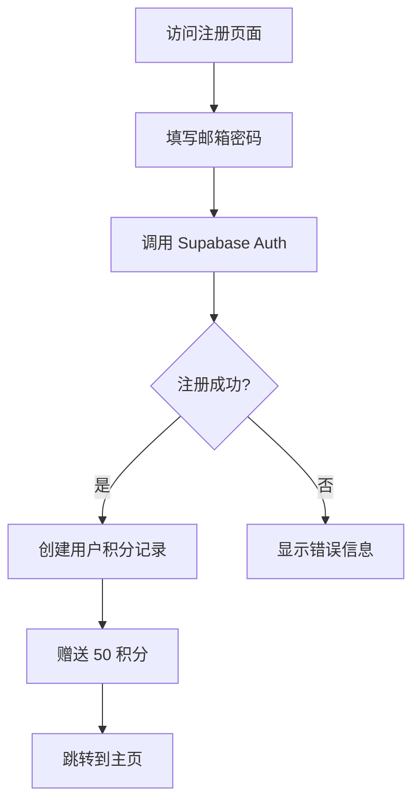
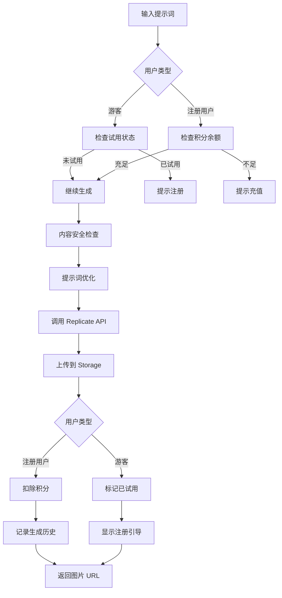
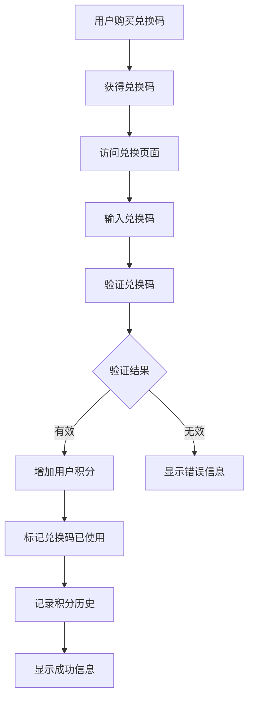
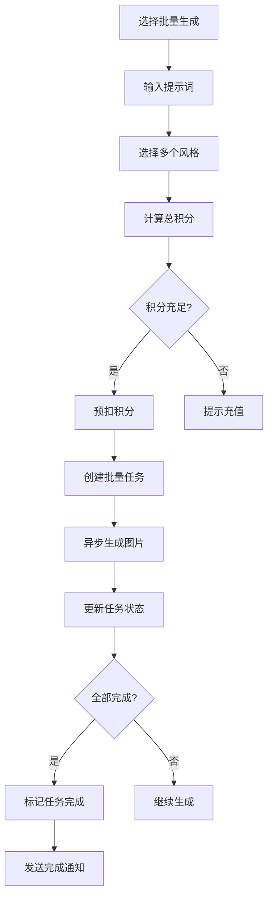

# AI Image Generator 项目完整文档

> 本文档为 AI 图像生成器项目的全面技术文档，旨在帮助开发者和 AI 助手深入理解项目架构、业务逻辑和技术实现。

## 目录

1. [项目概述](#项目概述)
2. [技术架构](#技术架构)
3. [项目结构](#项目结构)
4. [核心功能模块](#核心功能模块)
5. [数据库设计](#数据库设计)
6. [API 接口文档](#api-接口文档)
7. [业务流程详解](#业务流程详解)
8. [安全机制](#安全机制)
9. [部署与运维](#部署与运维)
10. [开发指南](#开发指南)

## 项目概述

### 产品定位
AI Image Generator 是一个基于积分制的商业化 AI 图像生成服务平台。用户可以通过自然语言描述生成高质量的 AI 图像，支持多种艺术风格，提供游客试用、积分充值、批量生成等功能。

### 核心特性
- 🎨 **多风格支持**：自然、动漫、油画、水彩、像素、吉卜力等 6 种预设风格
- 👤 **灵活的用户体系**：支持游客试用和注册用户两种模式
- 💰 **积分付费系统**：新用户送 50 积分，每张图片消耗 10 积分
- 🎫 **兑换码系统**：三档兑换码（100/300/1000 积分）
- 📦 **批量生成**：支持一次生成多种风格的图片
- 🌐 **中文优化**：自动识别中文并优化提示词
- 🛡️ **内容安全**：内置敏感词过滤和 NSFW 检测
- 👨‍💼 **管理后台**：兑换码管理、用户管理等功能

### 商业模式
1. **免费试用**：游客可免费生成 1 张图片
2. **注册奖励**：新用户注册获得 50 积分（5 张图片）
3. **付费充值**：通过淘宝购买兑换码充值积分
4. **批量优惠**：兑换码分级定价，量大优惠

## 技术架构

### 技术栈

#### 前端技术
- **框架**：Next.js 14 (App Router)
- **语言**：TypeScript
- **样式**：Tailwind CSS + CSS Modules
- **UI 组件库**：shadcn/ui (基于 Radix UI)
- **状态管理**：React Hooks + Context API
- **表单验证**：Zod
- **动画**：Tailwind CSS Animation + Custom CSS

#### 后端技术
- **运行时**：Node.js
- **框架**：Next.js API Routes
- **认证**：Supabase Auth
- **数据库**：PostgreSQL (通过 Supabase)
- **对象存储**：Supabase Storage
- **AI 服务**：Replicate API

#### 基础设施
- **部署平台**：Vercel
- **CDN**：Vercel Edge Network
- **监控**：Vercel Analytics

### 系统架构图

```
┌─────────────────────────────────────────────────────────────────┐
│                          用户界面层                              │
│  ┌─────────────┐  ┌─────────────┐  ┌─────────────┐            │
│  │   主页      │  │  历史记录   │  │   管理后台  │            │
│  │ (生成界面)  │  │   页面      │  │    页面     │            │
│  └─────────────┘  └─────────────┘  └─────────────┘            │
└─────────────────────────────────────────────────────────────────┘
                                │
                                ▼
┌─────────────────────────────────────────────────────────────────┐
│                          API 路由层                              │
│  ┌──────────────┐  ┌──────────────┐  ┌──────────────┐         │
│  │ /generate    │  │  /credits    │  │  /redeem     │         │
│  │  -image      │  │              │  │              │         │
│  └──────────────┘  └──────────────┘  └──────────────┘         │
└─────────────────────────────────────────────────────────────────┘
                                │
                                ▼
┌─────────────────────────────────────────────────────────────────┐
│                          业务逻辑层                              │
│  ┌──────────────┐  ┌──────────────┐  ┌──────────────┐         │
│  │ 图片生成服务 │  │  积分管理    │  │  用户认证    │         │
│  │              │  │    服务      │  │    服务      │         │
│  └──────────────┘  └──────────────┘  └──────────────┘         │
└─────────────────────────────────────────────────────────────────┘
                                │
                                ▼
┌─────────────────────────────────────────────────────────────────┐
│                          外部服务层                              │
│  ┌──────────────┐  ┌──────────────┐  ┌──────────────┐         │
│  │  Supabase    │  │  Replicate   │  │   Vercel     │         │
│  │ (Auth/DB/    │  │    API       │  │   Hosting    │         │
│  │  Storage)    │  │              │  │              │         │
│  └──────────────┘  └──────────────┘  └──────────────┘         │
└─────────────────────────────────────────────────────────────────┘
```

## 项目结构

### 目录结构详解

```
ai-image-generator/
├── app/                          # Next.js App Router 目录
│   ├── api/                      # API 路由
│   │   ├── generate-image/       # 图片生成接口
│   │   ├── credits/              # 积分管理接口
│   │   ├── redeem/               # 兑换码验证接口
│   │   ├── batch-generate/       # 批量生成接口
│   │   ├── batch-status/         # 批量任务状态查询
│   │   ├── generation-history/   # 生成历史记录
│   │   ├── models/               # AI 模型列表
│   │   ├── migrate-guest-data/   # 游客数据迁移
│   │   └── admin/                # 管理员接口
│   │       ├── generate-codes/   # 生成兑换码
│   │       └── cleanup-images/   # 清理图片
│   │
│   ├── (pages)/                  # 页面路由
│   │   ├── page.tsx              # 主页
│   │   ├── login/                # 登录页
│   │   ├── register/             # 注册页
│   │   ├── profile/              # 个人资料
│   │   ├── history/              # 历史记录
│   │   ├── generations/          # 生成记录
│   │   ├── batch/                # 批量生成
│   │   ├── recharge/             # 充值页面
│   │   ├── redeem/               # 兑换码页面
│   │   └── admin/                # 管理页面
│   │       └── redeem-codes/     # 兑换码管理
│   │
│   ├── (legal)/                  # 法律相关页面
│   │   ├── privacy/              # 隐私政策
│   │   ├── terms/                # 服务条款
│   │   ├── refund/               # 退款政策
│   │   └── agreement/            # 用户协议
│   │
│   ├── layout.tsx                # 根布局
│   ├── globals.css               # 全局样式
│   └── favicon.ico               # 网站图标
│
├── components/                   # React 组件
│   ├── ui/                       # 基础 UI 组件（shadcn/ui）
│   │   ├── button.tsx            # 按钮组件
│   │   ├── card.tsx              # 卡片组件
│   │   ├── dialog.tsx            # 对话框组件
│   │   ├── input.tsx             # 输入框组件
│   │   ├── select.tsx            # 选择器组件
│   │   ├── tabs.tsx              # 标签页组件
│   │   ├── toast.tsx             # 提示组件
│   │   └── ...                   # 其他基础组件
│   │
│   ├── ImageGenerator.tsx        # 核心图片生成组件
│   ├── BatchImageGenerator.tsx   # 批量生成组件
│   ├── navigation.tsx            # 顶部导航栏
│   ├── Footer.tsx                # 页脚组件
│   ├── BeianInfo.tsx             # 备案信息组件
│   ├── credit-balance.tsx        # 积分余额显示
│   ├── recharge-packages.tsx     # 充值套餐组件
│   └── Cute*.tsx                 # 可爱风格 UI 组件系列
│
├── lib/                          # 工具库和服务
│   ├── supabase.ts               # 客户端 Supabase 实例
│   ├── supabase-server.ts        # 服务端 Supabase 实例
│   ├── image-service.ts          # 图片生成服务
│   ├── credits.ts                # 积分管理服务
│   ├── storage.ts                # 文件存储服务
│   ├── prompt-optimizer.ts       # 提示词优化器
│   ├── guest-trial.ts            # 游客试用功能
│   ├── auth-enhanced.ts          # 增强认证功能
│   ├── batch-queue.ts            # 批量任务队列
│   ├── redeem-utils.ts           # 兑换码工具
│   ├── security.ts               # 安全相关功能
│   ├── rate-limiter.ts           # 速率限制
│   └── utils.ts                  # 通用工具函数
│
├── supabase/                     # Supabase 相关
│   └── migrations/               # 数据库迁移文件
│
├── public/                       # 静态资源
│   └── images/                   # 图片资源
│
├── scripts/                      # 脚本文件
│   ├── security-check.js         # 安全检查脚本
│   ├── clean-cache.js            # 清理缓存脚本
│   └── generate-mcp-config.js    # MCP 配置生成脚本
│
├── .env.local                    # 环境变量（本地）
├── .gitignore                    # Git 忽略文件
├── package.json                  # 项目依赖
├── tsconfig.json                 # TypeScript 配置
├── next.config.js                # Next.js 配置
├── tailwind.config.js            # Tailwind CSS 配置
├── CLAUDE.md                     # Claude AI 指导文档
└── README.md                     # 项目说明文档
```

## 核心功能模块

### 1. 用户认证系统

#### 技术实现
- 基于 Supabase Auth 实现
- 支持邮箱注册/登录
- JWT token 认证
- 客户端和服务端双重认证

#### 用户类型
1. **游客用户**
   - 无需注册即可试用
   - 每个设备限制试用 1 次
   - 试用状态保存在 localStorage
   - 生成的图片保存在特定目录

2. **注册用户**
   - 完整功能访问
   - 初始赠送 50 积分
   - 可查看历史记录
   - 支持批量生成

#### 关键代码位置
- 客户端认证：`lib/supabase.ts`
- 服务端认证：`lib/supabase-server.ts`
- 增强认证功能：`lib/auth-enhanced.ts`
- 登录页面：`app/login/page.tsx`
- 注册页面：`app/register/page.tsx`

### 2. 图片生成系统

#### 核心功能
- 支持 6 种预设艺术风格
- 中英文提示词自动优化
- 实时进度反馈
- 生成失败自动重试
- 图片永久存储

#### 风格映射
```typescript
const stylePrompts = {
  natural: "photorealistic, highly detailed, professional photography",
  anime: "anime style, manga art, japanese animation",
  oil: "oil painting, traditional art, textured brushstrokes",
  watercolor: "watercolor painting, soft colors, artistic",
  pixel: "pixel art, 8-bit style, retro gaming",
  ghibli: "studio ghibli style, miyazaki, animated film"
}
```

#### 生成流程
1. **输入验证**：检查提示词长度、敏感词
2. **积分验证**：确保用户有足够积分
3. **提示词优化**：中文翻译、风格增强
4. **调用 AI 模型**：通过 Replicate API
5. **图片存储**：上传到 Supabase Storage
6. **积分扣除**：原子操作，支持回滚
7. **历史记录**：保存生成记录

#### 关键代码位置
- 生成组件：`components/ImageGenerator.tsx`
- API 接口：`app/api/generate-image/route.ts`
- 图片服务：`lib/image-service.ts`
- 提示词优化：`lib/prompt-optimizer.ts`

### 3. 积分系统

#### 积分规则
- 新用户注册：50 积分
- 每张图片：10 积分
- 兑换码充值：100/300/1000 积分

#### 技术特点
- 使用数据库事务确保原子性
- 失败自动回滚
- 完整的历史记录
- 防止并发问题

#### 积分操作流程
```typescript
// 扣除积分示例
async function deductCredits(userId: string, amount: number) {
  const { data, error } = await supabase.rpc('deduct_credits', {
    user_id: userId,
    amount: amount,
    description: '生成图片'
  })
  
  if (error) {
    // 自动回滚
    throw error
  }
  
  return data
}
```

#### 关键代码位置
- 积分服务：`lib/credits.ts`
- API 接口：`app/api/credits/route.ts`
- 余额组件：`components/credit-balance.tsx`

### 4. 批量生成系统

#### 功能特点
- 一次生成多种风格
- 异步任务队列
- 实时状态更新
- 批量优惠定价

#### 任务状态流转
```
pending → processing → completed/failed
```

#### 关键代码位置
- 批量生成组件：`components/BatchImageGenerator.tsx`
- API 接口：`app/api/batch-generate/route.ts`
- 任务队列：`lib/batch-queue.ts`
- 状态查询：`app/api/batch-status/[batchId]/route.ts`

### 5. 兑换码系统

#### 兑换码类型
- BASIC：100 积分
- STANDARD：300 积分
- PREMIUM：1000 积分

#### 安全机制
- 唯一性验证
- 过期时间检查
- 使用状态追踪
- 速率限制保护

#### 管理功能
- 批量生成兑换码
- CSV 格式导出
- 使用统计查看

#### 关键代码位置
- 兑换工具：`lib/redeem-utils.ts`
- API 接口：`app/api/redeem/route.ts`
- 管理页面：`app/admin/redeem-codes/page.tsx`
- 生成接口：`app/api/admin/generate-codes/route.ts`

### 6. 存储系统

#### 存储策略
- 使用 Supabase Storage
- 图片永久保存
- CDN 加速访问
- 自动生成缩略图

#### 文件组织
```
generated-images/
├── {userId}/                    # 注册用户目录
│   └── {timestamp}.png         # 生成的图片
└── guest_{timestamp}_{random}/ # 游客目录
    └── {timestamp}.png         # 游客图片
```

#### 关键代码位置
- 存储服务：`lib/storage.ts`
- 上传逻辑：`lib/image-service.ts`

## 数据库设计

### 核心数据表

#### 1. user_credits（用户积分表）
```sql
CREATE TABLE user_credits (
  id UUID PRIMARY KEY DEFAULT uuid_generate_v4(),
  user_id UUID REFERENCES auth.users(id) ON DELETE CASCADE,
  credits INTEGER NOT NULL DEFAULT 50,
  created_at TIMESTAMPTZ DEFAULT NOW(),
  updated_at TIMESTAMPTZ DEFAULT NOW()
);
```

#### 2. credit_history（积分历史表）
```sql
CREATE TABLE credit_history (
  id UUID PRIMARY KEY DEFAULT uuid_generate_v4(),
  user_id UUID REFERENCES auth.users(id) ON DELETE CASCADE,
  amount INTEGER NOT NULL,
  balance_after INTEGER NOT NULL,
  description TEXT,
  type VARCHAR(20) NOT NULL, -- 'add' | 'deduct'
  created_at TIMESTAMPTZ DEFAULT NOW()
);
```

#### 3. generation_history（生成历史表）
```sql
CREATE TABLE generation_history (
  id UUID PRIMARY KEY DEFAULT uuid_generate_v4(),
  user_id UUID REFERENCES auth.users(id) ON DELETE CASCADE,
  prompt TEXT NOT NULL,
  style VARCHAR(50),
  image_url TEXT NOT NULL,
  storage_path TEXT NOT NULL,
  parameters JSONB,
  created_at TIMESTAMPTZ DEFAULT NOW()
);
```

#### 4. batch_generations（批量任务表）
```sql
CREATE TABLE batch_generations (
  id UUID PRIMARY KEY DEFAULT uuid_generate_v4(),
  user_id UUID REFERENCES auth.users(id) ON DELETE CASCADE,
  prompt TEXT NOT NULL,
  batch_size INTEGER NOT NULL,
  styles TEXT[],
  status VARCHAR(20) DEFAULT 'pending',
  total_cost INTEGER NOT NULL,
  completed_count INTEGER DEFAULT 0,
  created_at TIMESTAMPTZ DEFAULT NOW(),
  updated_at TIMESTAMPTZ DEFAULT NOW()
);
```

#### 5. redeem_codes（兑换码表）
```sql
CREATE TABLE redeem_codes (
  id UUID PRIMARY KEY DEFAULT uuid_generate_v4(),
  code VARCHAR(20) UNIQUE NOT NULL,
  amount INTEGER NOT NULL,
  type VARCHAR(20) NOT NULL,
  used BOOLEAN DEFAULT FALSE,
  used_by UUID REFERENCES auth.users(id),
  used_at TIMESTAMPTZ,
  expires_at TIMESTAMPTZ NOT NULL,
  created_at TIMESTAMPTZ DEFAULT NOW()
);
```

#### 6. profiles（用户配置表）
```sql
CREATE TABLE profiles (
  id UUID PRIMARY KEY REFERENCES auth.users(id) ON DELETE CASCADE,
  email TEXT,
  is_admin BOOLEAN DEFAULT FALSE,
  created_at TIMESTAMPTZ DEFAULT NOW(),
  updated_at TIMESTAMPTZ DEFAULT NOW()
);
```

### 数据库索引
```sql
-- 性能优化索引
CREATE INDEX idx_generation_history_user_id ON generation_history(user_id);
CREATE INDEX idx_credit_history_user_id ON credit_history(user_id);
CREATE INDEX idx_redeem_codes_code ON redeem_codes(code);
CREATE INDEX idx_batch_generations_user_id ON batch_generations(user_id);
```

### Row Level Security (RLS)
```sql
-- 用户只能访问自己的数据
ALTER TABLE generation_history ENABLE ROW LEVEL SECURITY;

CREATE POLICY "Users can view own generation history" ON generation_history
  FOR SELECT USING (auth.uid() = user_id);

-- 类似的 RLS 策略应用于其他表
```

## API 接口文档

### 1. 图片生成接口

**端点**：`POST /api/generate-image`

**请求体**：
```json
{
  "prompt": "一只可爱的猫咪",
  "style": "anime",
  "userId": "uuid-string",
  "isGuest": false
}
```

**响应示例**：
```json
{
  "imageUrl": "https://xxx.supabase.co/storage/v1/object/public/generated-images/..."
}
```

**错误码**：
- 400：输入验证失败
- 401：未授权
- 403：积分不足
- 408：生成超时
- 429：请求过于频繁
- 500：服务器错误

### 2. 积分查询接口

**端点**：`GET /api/credits?userId={userId}`

**响应示例**：
```json
{
  "credits": 150
}
```

### 3. 兑换码验证接口

**端点**：`POST /api/redeem`

**请求体**：
```json
{
  "code": "BASIC-XXXXX-XXXXX"
}
```

**响应示例**：
```json
{
  "success": true,
  "amount": 100,
  "code": "BASIC-XXXXX-XXXXX"
}
```

### 4. 批量生成接口

**端点**：`POST /api/batch-generate`

**请求体**：
```json
{
  "prompt": "美丽的风景",
  "styles": ["natural", "oil", "watercolor"],
  "batchSize": 3
}
```

**响应示例**：
```json
{
  "success": true,
  "batchId": "uuid-string",
  "totalCost": 30,
  "estimatedTime": 45,
  "message": "批量任务已创建"
}
```

### 5. 管理员接口

**生成兑换码**：`POST /api/admin/generate-codes`

**请求体**：
```json
{
  "type": "STANDARD",
  "count": 10,
  "expiresInDays": 30
}
```

**响应示例**：
```json
{
  "success": true,
  "codes": [
    {
      "id": "uuid",
      "code": "STANDARD-XXXXX-XXXXX",
      "amount": 300,
      "expires_at": "2024-12-31T23:59:59Z"
    }
  ]
}
```

## 业务流程详解

### 1. 用户注册流程



### 2. 图片生成流程



### 3. 积分充值流程



### 4. 批量生成流程



## 安全机制

### 1. 内容安全

#### 敏感词过滤
```typescript
const sensitiveWords = [
  // 政治敏感词
  // 色情相关词
  // 暴力相关词
  // 其他违规内容
];

function checkSensitiveContent(text: string): boolean {
  const lowerText = text.toLowerCase();
  return !sensitiveWords.some(word => lowerText.includes(word));
}
```

#### NSFW 检测
- 在提示词阶段进行预检
- 调用 API 前二次验证
- 生成后结果检查

### 2. 速率限制

#### 实现机制
```typescript
const rateLimiter = new Map();

function checkRateLimit(identifier: string, limit: number, window: number) {
  const now = Date.now();
  const userLimits = rateLimiter.get(identifier) || [];
  
  // 清理过期记录
  const validLimits = userLimits.filter(
    time => now - time < window
  );
  
  if (validLimits.length >= limit) {
    return false; // 超过限制
  }
  
  validLimits.push(now);
  rateLimiter.set(identifier, validLimits);
  return true;
}
```

#### 限制策略
- 图片生成：每分钟 5 次
- 兑换码验证：每小时 10 次
- API 调用：每秒 10 次

### 3. 认证与授权

#### JWT Token 验证
```typescript
async function verifyToken(token: string) {
  const { data: { user }, error } = await supabase.auth.getUser(token);
  
  if (error || !user) {
    throw new Error('Invalid token');
  }
  
  return user;
}
```

#### 管理员权限检查
```typescript
async function checkAdminPermission(userId: string) {
  const { data: profile } = await supabase
    .from('profiles')
    .select('is_admin')
    .eq('id', userId)
    .single();
    
  return profile?.is_admin || false;
}
```

### 4. 数据安全

#### 输入验证
- 使用 Zod 进行类型验证
- SQL 注入防护（参数化查询）
- XSS 防护（输入消毒）

#### 数据加密
- HTTPS 传输加密
- 敏感数据字段加密存储
- 环境变量安全管理

## 部署与运维

### 1. 部署流程

#### Vercel 部署
```bash
# 1. 安装 Vercel CLI
npm i -g vercel

# 2. 登录 Vercel
vercel login

# 3. 部署项目
vercel --prod
```

#### 环境变量配置
在 Vercel 控制台设置以下环境变量：
```
NEXT_PUBLIC_SUPABASE_URL
NEXT_PUBLIC_SUPABASE_ANON_KEY
SUPABASE_SERVICE_ROLE_KEY
REPLICATE_API_TOKEN
REPLICATE_MODEL
```

### 2. 监控与日志

#### 性能监控
- Vercel Analytics
- 自定义性能指标
- 错误追踪

#### 日志管理
```typescript
// 统一日志格式
function log(level: 'info' | 'warn' | 'error', message: string, data?: any) {
  const timestamp = new Date().toISOString();
  console.log(JSON.stringify({
    timestamp,
    level,
    message,
    data
  }));
}
```

### 3. 备份策略

#### 数据库备份
- Supabase 自动备份
- 定期导出重要数据
- 异地备份存储

#### 图片备份
- Supabase Storage 自动备份
- CDN 缓存策略
- 定期清理过期文件

## 开发指南

### 1. 环境搭建

#### 克隆项目
```bash
git clone git@github.com:yourusername/ai-image-generator.git
cd ai-image-generator
```

#### 安装依赖
```bash
npm install
```

#### 配置环境变量
创建 `.env.local` 文件：
```env
NEXT_PUBLIC_SUPABASE_URL=your_supabase_url
NEXT_PUBLIC_SUPABASE_ANON_KEY=your_supabase_anon_key
SUPABASE_SERVICE_ROLE_KEY=your_service_role_key
REPLICATE_API_TOKEN=your_replicate_token
REPLICATE_MODEL=black-forest-labs/flux-schnell
```

#### 启动开发服务器
```bash
npm run dev
```

### 2. 代码规范

#### TypeScript 规范
```typescript
// 使用明确的类型定义
interface GenerateImageParams {
  prompt: string;
  style?: ImageStyle;
  userId?: string;
  isGuest?: boolean;
}

// 使用 enum 定义常量
enum ImageStyle {
  Natural = 'natural',
  Anime = 'anime',
  Oil = 'oil',
  // ...
}
```

#### 组件规范
```tsx
// 使用函数式组件
export default function ImageGenerator({ 
  onGenerate,
  disabled = false 
}: ImageGeneratorProps) {
  // 组件逻辑
}

// Props 类型定义
interface ImageGeneratorProps {
  onGenerate: (imageUrl: string) => void;
  disabled?: boolean;
}
```

### 3. 测试指南

#### 单元测试
```typescript
// 使用 Jest 进行单元测试
describe('Credits Service', () => {
  it('should deduct credits correctly', async () => {
    const result = await deductCredits('user-id', 10);
    expect(result.success).toBe(true);
    expect(result.newBalance).toBeGreaterThanOrEqual(0);
  });
});
```

#### 集成测试
```typescript
// API 端点测试
describe('POST /api/generate-image', () => {
  it('should generate image successfully', async () => {
    const response = await fetch('/api/generate-image', {
      method: 'POST',
      body: JSON.stringify({
        prompt: 'test prompt',
        style: 'natural'
      })
    });
    
    expect(response.status).toBe(200);
  });
});
```

### 4. 常见问题

#### Q: 如何添加新的图片风格？
A: 
1. 在 `lib/image-service.ts` 中添加风格映射
2. 更新 `components/ImageGenerator.tsx` 中的风格选项
3. 在提示词优化器中添加相应的增强词

#### Q: 如何调整积分价格？
A: 
1. 修改 `lib/credits.ts` 中的 `CREDIT_COST_PER_IMAGE` 常量
2. 更新相关 UI 组件中的显示
3. 确保数据库事务逻辑正确

#### Q: 如何添加新的 AI 模型？
A: 
1. 在 Replicate 上找到模型 ID
2. 更新环境变量 `REPLICATE_MODEL`
3. 调整 `lib/image-service.ts` 中的参数

## 总结

AI Image Generator 是一个功能完整、架构合理的商业化 AI 图像生成服务。项目采用现代化的技术栈，具有良好的可扩展性和维护性。通过积分制的商业模式，既能提供免费试用降低用户门槛，又能通过付费充值实现商业变现。

### 项目亮点

1. **技术架构先进**：采用 Next.js 14 最新特性，性能优秀
2. **用户体验良好**：支持游客试用，中文优化，界面友好
3. **安全机制完善**：多层次的安全防护，内容审核严格
4. **商业模式清晰**：积分制付费，兑换码系统完善
5. **可扩展性强**：模块化设计，易于添加新功能

### 未来展望

1. **功能扩展**
   - 支持更多 AI 模型
   - 添加图片编辑功能
   - 实现社区分享功能

2. **技术优化**
   - 引入 Redis 缓存
   - 实现 WebSocket 实时通信
   - 优化批量生成性能

3. **商业拓展**
   - 接入更多支付方式
   - 推出会员订阅制
   - 开发企业版服务

---

本文档持续更新中，最后更新时间：2024年12月